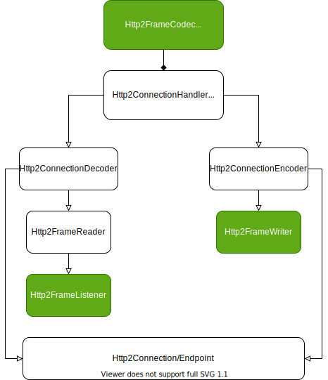

# OverView

## Http2ConnectionHandler

在上一篇blog已经大体介绍了。
> 设计上，他可以说主要是Inbound handler，继承自ByteToMessageDecoder，通过内部decoder来对http2协议进行decode，decoder内部再委托给使用者自己实现的Http2FrameListener对收到的http2消息进行业务处理。这里和netty中常见的decoder decode出协议封装成对象消息交给pipeline下游业务handler的做法不太一样。另外，他在实现上又实现了ChannelOutboundHandler接口，看上去主要是为了实现flush方法，并不是作为一个encoder handler。如果使用方想去向连接上响应http2的response还需要通过他的encoder()方法拿到一个Http2FrameWriter对象，通过Http2FrameWriter的各种writeXXX接口直接write对应的http2消息/帧，可以说非常原始了。

<!--more-->

### Http2ConnectionDecoder
Http2ConnectionHandler内部负责http2协议decode的接口。

注意他的作用不仅在于decode出协议frame，而且还会进行一些http2定义控制语义行为：比如流量控制、流优先级控制等等。做完这些http2协议定义的控制行为后将帧通过`Http2FrameListener`通知给上层业务（这里也不一定是传输层之上的上层业务，http2层面也有很多Http2FrameListener的实现）

另外一点就是：他不直接decoder http2协议数据，而是委托给内部的`Http2FrameReader`去做真正的解析工作

值得一提的Http2ConnectionHandler虽然是一个ByteToMessageDecoder，但是在其decode方法的实现中并没有将decode出的frame msg通过`out`形参传递给pipeline的下一个handler，而是调用`Http2FrameListener`对应的方法通知应用程序。

### Http2FrameReader
实际进行http2协议decode的接口，默认实现`DefaultHttp2FrameReader`在readFrame方法中对netty read得到的ByteBuf进行decode，实现上没有使用netty提供的LengthFieldBasedFrameDecoder, 自己通过do while循环实现帧解析，然后调用`Http2FrameListener`对应的方法。

### Http2FrameListener
前面已经多次提到，业务层需要实现的接口，用于接受http2的各种数据+控制帧

### Http2ConnectionEncoder
和`Http2ConnectionDecoder`基本对等，其作用也不仅在于encode frame，同时他也需要实现http2定义的控制语义行为。

为了做到这样，他在定义上继承了`Http2FrameWriter`接口，这样应用在有帧要发送时需要先经过他，执行完协议的控制行为后再通过调用内部的`Http2FrameWriter` 进行基本的encode & write。

### Http2FrameWriter
作用和`Http2FrameReader` + `Http2FrameListener` 组合基本对等，提供了各种writeXXX方法用于向connection上写入http2的各种frame。

默认实现`DefaultHttp2FrameWriter`中实现了所有writeXXX接口，做了最基本的http2协议encode、以及将encode得到的ByteBuf write给Channel。

### Http2Connection
对http2连接的抽象，内部主要管理连接上所有的流（Http2Stream）。
- 提供api根据stream id查询stream、遍历所有的active stream。
- 另外定义了一个stream生命周期实际的listener，提供增加删除listener的api。
- 定义Endpoint接口（某一端对connection的视图），提供返回local/remote视图的api

#### Endpoint
Connection在某一端的视图，是因为一个Connection两端都可以发起stream、两端也都有独立的状态数据
实现上它是Http2Connection的内部接口，能够访问Http2Connection的实现所有属性，同时提供一些创建stream相关的api，以及获取当前端flowController的api

#### Listener
Http2Connection内部定义的Listener接口是为了能够接受connection上stream的各种生命周期事件的通知。

在DefaultHttp2Connection的实现里，通过listeners list做到依次通知所有listener

## Http2FrameCodec
在上一篇blog也已经大体介绍了。

> 回到Http2FrameCodec本身，他作为http2 frame的codec，继承自Http2ConnectionHandler，负责对当前存活着的stream上frame进行decode和encode, 和下游handler之间通过Http2StreamFrame进行交互。

在实现上，他主要做了两件事
- inbound: 通过在内部的`Http2FrameListener` 实现的各个onXXXFrame方法里对各种frame数据进行封装，封装成对应的`Http2Frame`对象。然后向channel上将`Http2Frame`对象通过fireChannelRead fire给下一个handler。
- outbound: 在write方法里通过msg的类型(各种`Http2Frame`实现类)来决定调用内部`Http2ConnectionEncoder`相对应的writeXXX方法

## Http2MultiplexHandler
在上一篇blog也已经大体介绍了。

> 这个类主要是对http2 stream复用这个行为进行了封装，当连接上有新的stream创建时，为其创建一个新的Http2MultiplexHandlerStreamChannel，并注册到eventLoop中，并对应用代码的handler屏蔽或者转换一些原有连接上frame消息（主要是控制frame），使得应用handler面向新的Http2MultiplexHandlerStreamChannel编程，只需要关注子channel上的事件。使用上需要和Http2FrameCodec一起使用。

